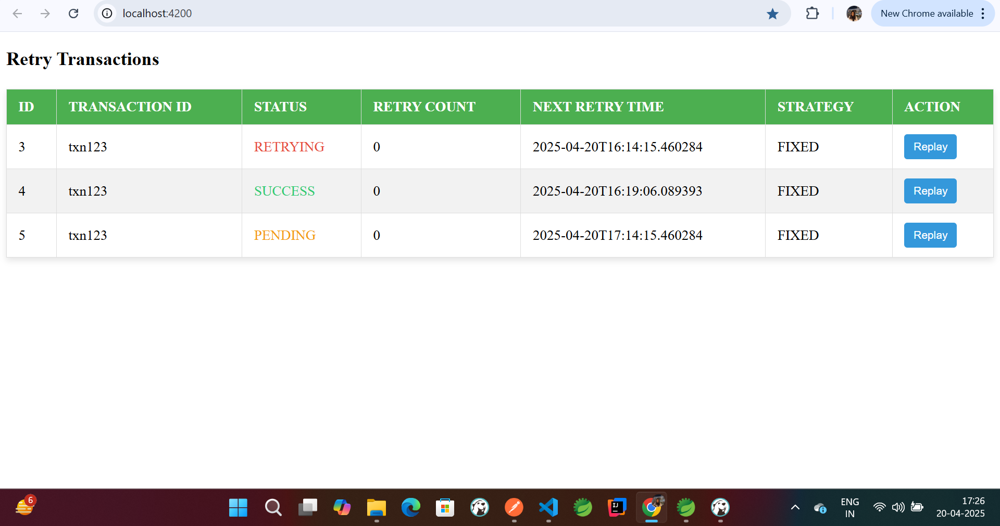

# InnovateHER-Java-Developers-Hiring-Hackathon

# 🔁 Retry & Replay Framework - Hackathon Project

## 🚀 Introduction

**Chubb** is one of the world’s largest publicly traded property and casualty insurance companies. In a world where system failures and transient errors are inevitable, applications must remain resilient and ensure recovery without compromising data integrity or user experience.

This project is a solution to the **Retry & Replay Framework Hackathon Challenge**, providing a robust architecture for handling failures in integrated systems by automating retry mechanisms and enabling transaction replays.

---

## 📌 Project Overview

This full-stack application consists of:

- 🌐 **Frontend**: Angular 17 with NG-ZORRO for a modern, role-based UI.
- 🔧 **Backend**: Spring Boot (Java) using JPA, REST APIs, Quartz Scheduler.
- 🛠️ **Database**: MySQL for storing retry transaction states.
- 📋 **Optional Integration**: Kafka for event-driven retries.

The system supports:
- Transaction retrying with customizable strategies.
- Manual transaction replay from UI.
- Monitoring and reporting through a structured dashboard.

**To download the full project, you can access the files from Google Drive [here](https://drive.google.com/drive/folders/1FHq90xQoFoIj-sQA6GK9nIDDIYEScjIK).**

---

## 🎯 Objective

Design and implement a **scalable**, **configurable**, and **user-friendly** Retry & Replay Framework that ensures business continuity by:

- Automatically retrying transient failures using various strategies.
- Allowing manual replays for failed transactions.
- Providing detailed transaction logging, monitoring, and alerting.

---

## 🧩 Features

### ✅ Retry Mechanism

- 🔁 Configurable retry strategies using Spring Boot & Quartz:
  - **Fixed Interval**
  - **Exponential Backoff**
  - **Jitter**
  - **Circuit Breaker**

- 🧠 Dynamic strategy selection based on transaction characteristics.
- 🧾 Retry logic applied via schedulers and state machine patterns.
- 🔄 Optional Kafka integration for event-driven retries.

### 🔄 Replay Mechanism

- 🔧 Manual replay of failed transactions from UI.
- ✅ Validates business rules before replaying.
- 🕒 Supports stateful and stateless replays.
- ⏰ Immediate or scheduled replay execution.

### 👩‍💼 UI

- 🌐 Angular frontend with clean view.
- 📊 View, replay, and track transaction status.

- 

### 🛡️ Logging & Monitoring

- 🧾 Structured logs with **correlation IDs** for traceability.
- 📑 Full history of retry/replay attempts and outcomes.
- 📬 Email notifications on retry/replay completion or failure (future enhancement).
- 🔔 Option to trigger incidents on repeated failures (future scope).

---

## 🖥️ Tech Stack

| Layer        | Tech Used                              |
|--------------|-----------------------------------------|
| Frontend     | Angular 17, TypeScript, NG-ZORRO        |
| Backend      | Java, Spring Boot, Spring Scheduler     |
| Retry Engine | Quartz Scheduler, Apache Camel (optional) |
| Data Store   | MySQL, JPA                         |
| Messaging    | Kafka (Optional for future extension)   |
| Logs & Alerts| Spring Logging (SLF4J), Logback         |

---

## 📦 Project Structure

### Backend Jar
### Frontend Jar
